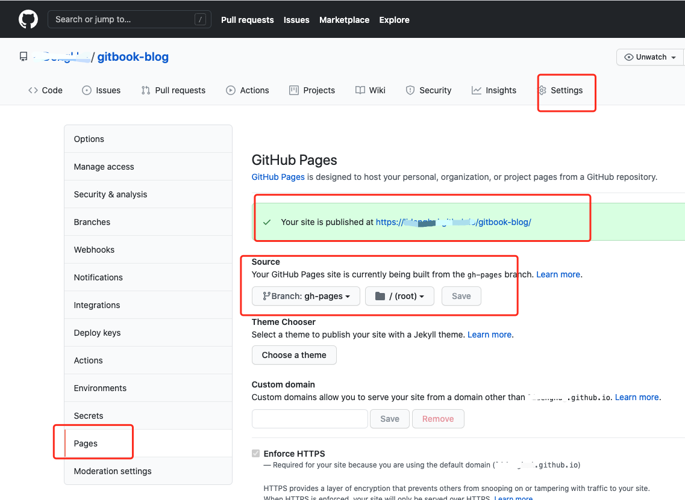

# 添加github的静态站点

## 配置静态站点分支

在分支上创建 `gh-pages` 分支
## 配置静态站点路径




## 使用`gh-pages`库添加分支

```js
var ghpages = require('gh-pages');
ghpages.publish('_book', function(err) {
    if(err) {
        console.log("publish Error", err)
    }
    console.log('publish Success')
});
```
该命令会自动将 `_book`文件推送到远程的 gh-pages分支